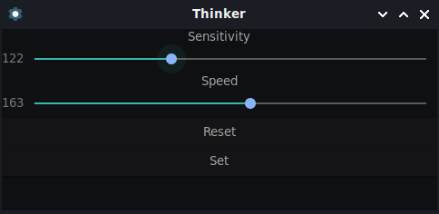

# thinker
<br/>
Minimal GTK3 frontend for configuring the thinkpad trackpoint on Linux. <br/>
## Installing
```
$ git clone https://github.com/vp1147/thinker thinker
$ cd thinker
$ chmod +x thinker.sh
```
Now just run the shell script:
```
$ ./thinker.sh
```
It will search for the device and request your permission to modify its properties.
## Compatibility
### As of my knowledge, it currently works on:
Lenovo ThinkPad T410

### If this code works fine on yout device, please create a issue with the `compatibility` label, so I can expand this list.
